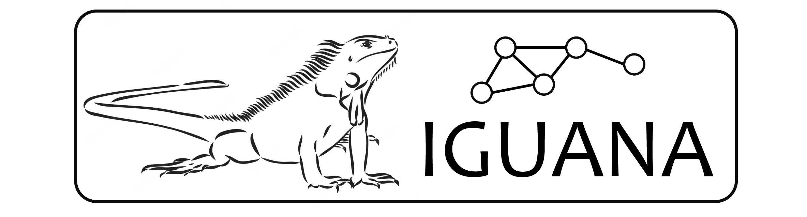

<p align="center">
  
</p>

# Interpretable Gland-Graph Networks using a Neural Aggregator

IGUANA is a graph neural network built for colon biopsy screening. IGUANA represents a whole-slide image (WSI) as a graph built with nodes on top of glands in the tissue, each node associated with a set of interpretable features. The output of the pipeline is explainable, indicating glands and features that contribute to a WSI being predicted as abnormal. 

For a full description, take a look at our [preprint](https://doi.org/10.1101/2022.10.17.22279804).

## Set Up Environment

```
# create base conda environment
conda env create -f environment.yml

# activate environment
conda activate iguana

# install PyTorch with pip
pip install torch==1.10.1+cu102 torchvision==0.11.2+cu102 -f https://download.pytorch.org/whl/cu102/torch_stable.html

# install PyTorch Geometric and dependencies
pip install torch-scatter -f https://data.pyg.org/whl/torch-1.10.1+cu102.html
pip install torch-sparse -f https://data.pyg.org/whl/torch-1.10.1+cu102.html
pip install torch-geometric
```

## Repository Structure

- `doc`: image files used for rendering the README - not necessary for running the code. 
- `dataloader`: contains code for loading the data to the model.
- `explainer`: utility scripts and functions for explanation method.
- `metrics`: utility scripts and functions for computing metrics/statistics.
- `misc`: miscellaneous scripts and functions.
- `models`: scripts relating to defining the model, the hyperparameters and I/O configuration.
- `run_utils`: main engine and callbacks.

## Graph Construction and Training

### Histological Segmentation
As a first step, WSIs need to be processed with Cerberus to perform simultaneous prediction of:
- Nuclear segmentation and classification
- Gland segmentation and classification
- Lumen segmentation
- Tissue type classification

Refer to [this repository](https://github.com/TissueImageAnalytics/cerberus) for details on how to run Cerberus.

### Feature Extraction
To perform feature extraction run `extract-feats.py`. To see a full list of command line arguments, use:

```
python extract_feats.py -h
```

You will see that one of the arguments is `focus_mode`. This denotes the non-epithelial area considered for cell quantification. For the original publication, we considered the lamina propria (`focus_mode=lp`) which is the area surrounding the glands. If `lp` is not selected, then the entire tissue is considered for cell quantification.

### Constructing the Graphs
Next, we convert the features into a format to be used by our graph learning model. Here, we also fill in missing values (denoted by `nan`).

To do this, run:

```
python create_graph.py --input_path=<path> --output_path=<path> --dist_thresh=<n> --data_info=<path>
```

- `input_path`: path to features extracted using `extract_feats.py`.
- `output_path`: path to where graph data will be saved.
- `dist_thresh`: only connect glands if they are within a distance less than this threshold. 
- `data_info`: information regarding the labels and fold info of the data. More info on this is provided when describing [model training](#training-the-model).

The above command converts the data to a dictionary with the following keys:

- `local_feats`: a dictionary where each key denotes the feature name and the corresponding values denote the features. Note, in this dictionary we also include the `obj_id`, which represents the unique identifier of each gland (as originally used in the Cerberus output).
- `edge_index`: 2xN array of indicies showing the presence of edges between nodes.
- `label`: The label of the graph.
- `wsi_name`: Filename of the WSI.

### Training the Model
To trigger training, use:

```
python run_train.py --gpu=<gpu_id> --device=<device> --compute_stats --compute_deg --deg_path=<path>
```

- `gpu`: a comma separated list indicating the GPUs in which to run the model on.
- `device`: either `cpu` or `cuda`.
- `compute_stats`: whether to compute statistics of all features in the dataset. This only need to be performed once for each dataset as it is quite time-consuming.
- `compute_deg`: PNA convolution uses the node degree information. Therefore, only consider this is using PNA. Again, only use this once per dataset as it can be time-consuming.
- `deg_path`: Path to where node degree info is located. If `compute_deg` is toggled on, then this will be the save path. 

Note, the directory where training logs are saved is set in `config.py`. Here, you can also set the name of the experiment run with `exp_nr`.

Additional hyperparameters, such as number of epochs and learning rate are set in `models/opt.py`.

All data info should be included in `dataset.py`. For your own dataset, you will need to create your own class! The code will expect that for each dataset, a corresponding `data_info` csv file is provided. The path to this file should be included in the relevant class in `dataset.py`. The csv file should have the following columns (**also ensure the same order**):

- `wsi_name`
- `fold_1`
- ...
- `fold_n`
- `label`

So, if considering 5 folds, then you will need to have 5 columns following `wsi_name`. `label` must be the final column. Within each fold column, 1 indicates training, 2 validation and 3 test. If not using cross-validation, then simply use a single column.


## Inference and Explanation

Insert general overview of inference and explanation

- Run model inference: `python run_infer.py`

- Get node explanations: `python run_explainer.py --node`

- Get feature explanations: `python run_explainer.py --feature`

- Get WSI-level explanations: `python run_explainer.py --wsi`

Note, node and feature explanations must have been run before triggering wsi explanation.

## Interactive Demo
We have made an interactive demo to help visualise the output of our model. Note, this is not optimised for mobile phones and tablets. The demo was built using the TIAToolbox [tile server](https://tia-toolbox.readthedocs.io/en/latest/_autosummary/tiatoolbox.visualization.tileserver.TileServer.html).

Check out the demo [here](https://iguana.dcs.warwick.ac.uk). 

In the demo, we provide multiple examples of WSI-level results. By default, glands are coloured by their node explanation score, indicating how much they contribute to the slide being predicted as abnormal. Glands can also be coloured by a specific feature using the drop-down menu on the right hand side.

As you zoom in, smaller objects such as lumen and nuclei will become visible. These are accordingly coloured by their predicted class. For example, epithelial cells are coloured green and lymphocytes red.

Each histological object can be toggled on/off by clicking the appropriate buton on the right hand side. Also, the colours and the opacity can be altered. 

To see which histological features are contributing to glands being flagged as abnormal, hover over the corresponding node. To view these nodes, toggle the graph on at the bottom-right of the screen.


## License

Code is under a GPL-3.0 license. See the [LICENSE](https://github.com/TissueImageAnalytics/cerberus/blob/master/LICENSE) file for further details.

Model weights are licensed under [Attribution-NonCommercial-ShareAlike 4.0 International](http://creativecommons.org/licenses/by-nc-sa/4.0/). Please consider the implications of using the weights under this license. 
